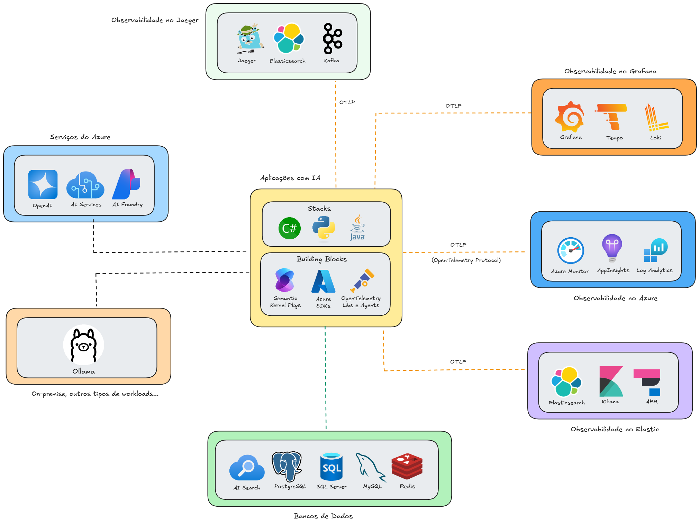

# semantickernel-dbs_ia-gen-agents-sp-2025-06
Conteúdos sobre apresentação envolvendo o uso de Semantic Kernel. Palestra realizada durante o evento "IA Generativa e Agents com Azure" em São Paulo-SP.

Exemplos de implementação - todos com OpenTelemetry + Semantic Kernel + .NET 9 + Azure OpenAI + Ollama + SQL Server/Azure SQL + Docker Compose:
- [Application Insights](https://github.com/renatogroffe/dotnet9-semantickernel-sqlserver-otel-azureappinsights_consultaprodutos)
- [Elastic APM](https://github.com/renatogroffe/dotnet9-semantickernel-sqlserver-otel-elasticapm_consultaprodutos)
- [Grafana](https://github.com/renatogroffe/dotnet9-semantickernel-sqlserver-otel-grafana_consultaprodutos)

Exemplo com OpenTelemetry + Semantic Kernel + .NET 9 + Azure OpenAI + Ollama + MySQL + Docker Compose:
- [Application Insights](https://github.com/renatogroffe/dotnet9-semantickernel-mysql-otel-azureappinsights_consultaprodutos)

Mais exemplos de implementação (todos utilizando OpenTelemetry + Semantic Kernel + .NET 9 + Azure OpenAI + Ollama + PostgreSQL + Docker Compose):
- [Application Insights](https://github.com/renatogroffe/dotnet9-semantickernel-postgres-otel-azureappinsights_consultaprodutos)
- [Elastic APM](https://github.com/renatogroffe/dotnet9-semantickernel-postgres-otel-elasticapm_consultaprodutos)
- [Grafana](https://github.com/renatogroffe/dotnet9-semantickernel-postgres-otel-grafana_consultaprodutos)
- [Jaeger](https://github.com/renatogroffe/dotnet9-semantickernel-postgres-otel-jaeger_consultaproduto)

---

## Um exemplo de arquitetura

---

https://developer.microsoft.com/en-us/reactor/events/26013/?wt.mc_id=1reg_26013_webpage_reactor
